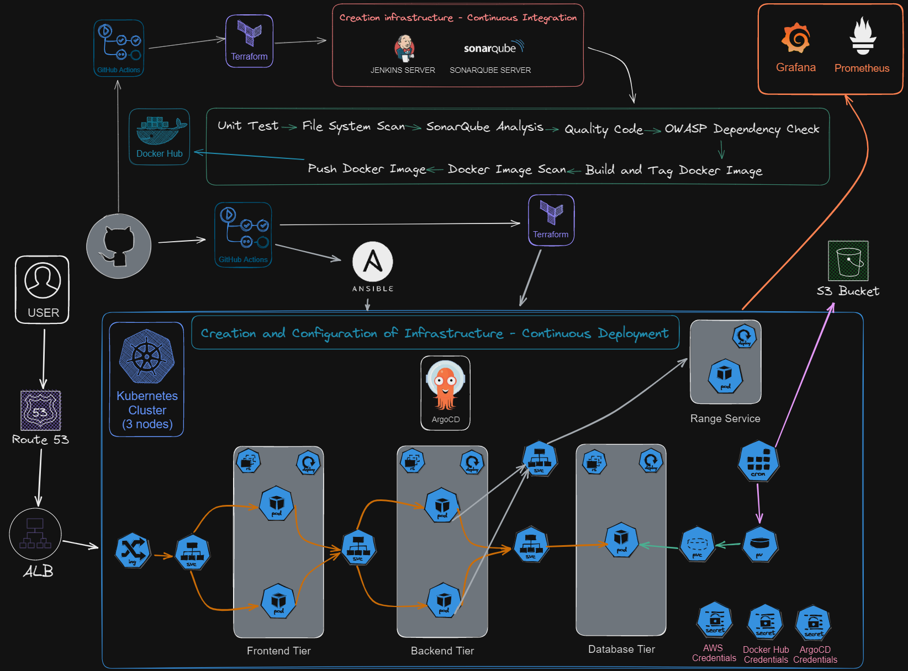

Welcome to Zeeurl project (DEMO)!

This repository hosts the implementation of a ShortURL using ReactJS, NodeJS, and MongoDB, deployed on a Kubernetes Cluster. The project covers a wide range of tools and practices for a "robust" and scalable DevOps setup.

### Design Attribution
The user interface layout of this project is inspired by [t.ly](https://t.ly).

### Continuous Integration Infrastructure
Utilizes GitHub Actions for version control and workflow automation
Terraform for infrastructure-as-code provisioning
Jenkins and SonarQube for continuous integration and code quality analysis
Docker Hub for container image management
Implements unit testing, file system scanning, and OWASP dependency checks

### Continuous Delivery Infrastructure
Utilizes GitHub Actions for version control and workflow automation
Terraform for infrastructure-as-code provisioning
Kubernetes cluster for container orchestration
Ansible for configuration management and deployment automation
Multi-tier architecture (Frontend, Backend, Database)
AWS Route 53 and load balancing
ArgoCD for GitOps-based continuous delivery

### Monitoring & Observability
Grafana and Prometheus for infrastructure and application monitoring

### Security & Credential Management
Integrated credential management for AWS, Docker Hub, and ArgoCD
Security scanning and quality checks throughout the pipeline

### Technical Improvements

### Improve Code Quality and Organization
Use React best practices for cleaner and more maintainable code.
Organize CSS code efficiently (e.g., modular CSS, CSS-in-JS, or utility-first frameworks like Tailwind CSS).

### Enhance System Resilience
Deploy redundant infrastructure for critical components:
2 Jenkins servers for CI/CD.
2 SonarQube servers for code quality analysis.
2 master nodes and 4 worker nodes for the Kubernetes cluster.
Distribute servers across different regions for high availability and disaster recovery.

### Secure Remote Access
Replace SSH with AWS Session Manager for secure and auditable connections to instances.

### Ensure Database Resilience
Implement a highly available database setup (e.g., multi-AZ RDS, Aurora Global Database, or database clustering).

### Optimize Performance with Caching
Set up a Redis cache to reduce database load and improve application performance.

### Apply Security Best Practices
Use the principle of least privilege by defining granular IAM policies for AWS resources.
Implement network policies in Kubernetes to control traffic between pods.

### License
This project is licensed under the [Apache License V2](LICENSE).