# Initial Manual Setup of Jenkins (First Run – ZeeURL)

For my very first DevOps project, I configured Jenkins manually to deeply understand each component.  
Here are the detailed steps with screenshots.

## Initial Setup

Access Jenkins via the server's public IP on port 8080.
AWS -> EC2 -> Jenkins Server -> Public IPv4 address

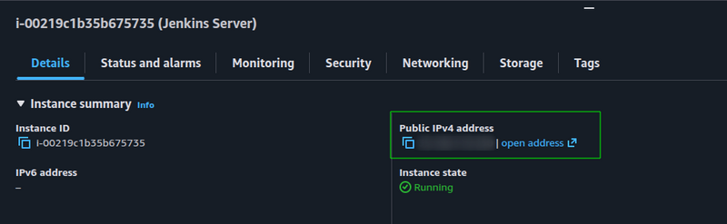

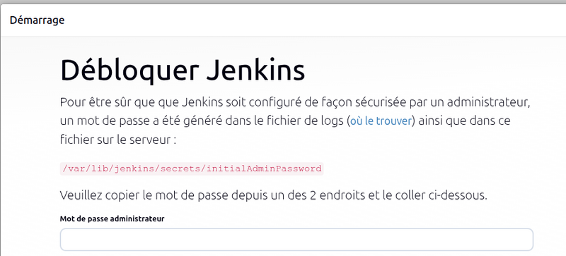

Once inside `Jenkins`, we start by creating the pipeline for the Express server (backend).

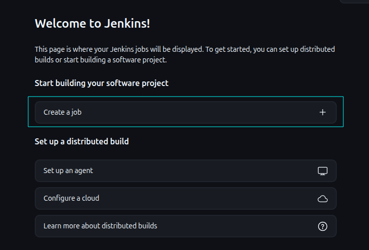

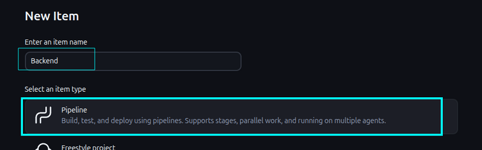

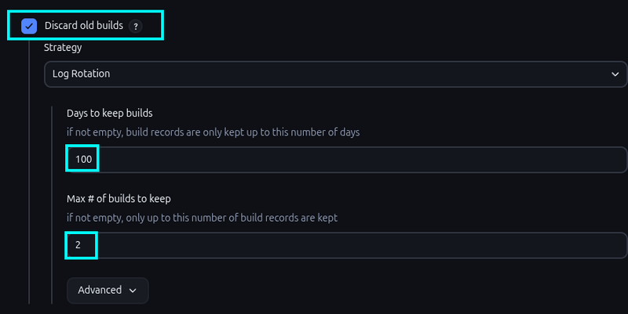

We need to create a `credential` so `Jenkins` can access our `GitHub repository`.  
To do this, we will generate an `SSH key` dedicated to Jenkins`.

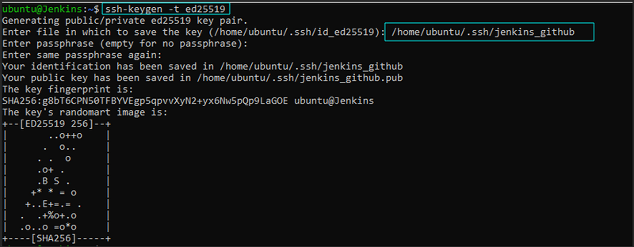

Next, retrieve the public key and add it to `GitHub` (in the Deploy keys section).

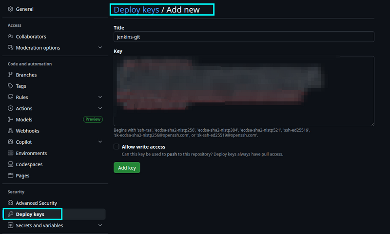

Then simply add the private key to `Jenkins`.

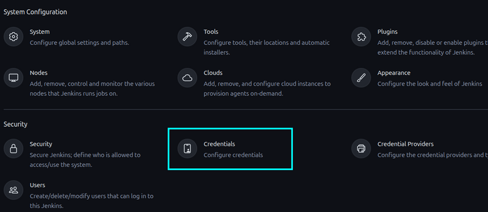

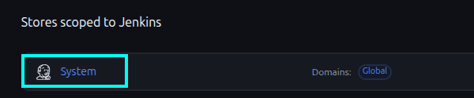

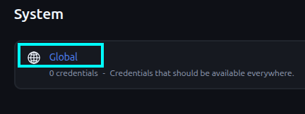

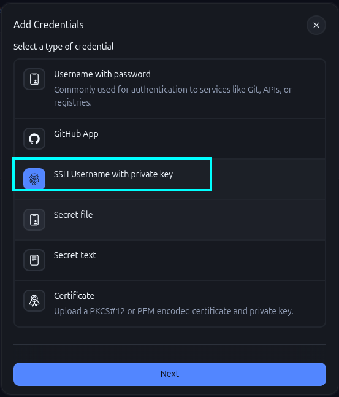

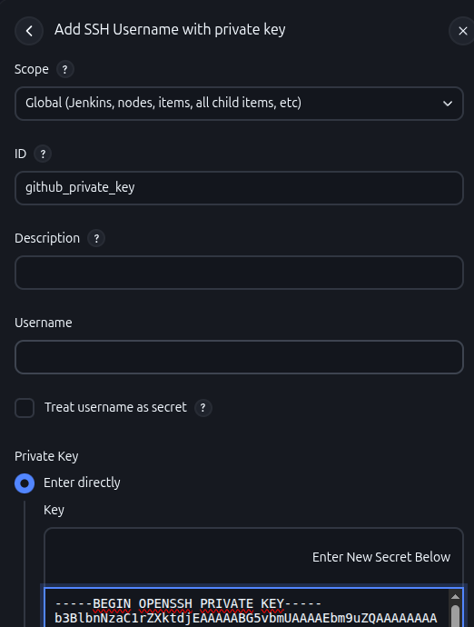

##### (If you protected the key with a passphrase, enter it in the Passphrase field.)

Next, tell Jenkins to accept first-time Git host connections…  
Dashboard → Manage Jenkins → Configure Global Security → Git Host Key Verification Configuration → **Accept first connection**.

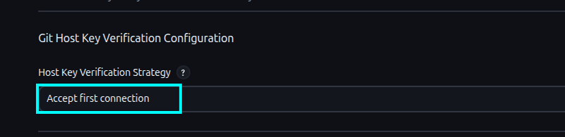

Now create the first pipeline step.

```groovy
pipeline {
    agent any

    stages {
        stage('Git Checkout') {
            steps {
                git credentialsId: 'github_private_key', url: 'git@github.com:Zeeward41/ZeeUrl.git'
            }
        }

}
}
```

##### Important: the `credentialsId` must exactly match the name created in the credentials step (github_private_key).

Run the pipeline to verify everything works.

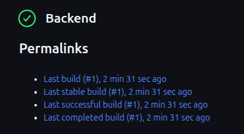

## Installing Dependencies

### NPM

We need NPM to install project dependencies.
Install the `NodeJS` plugin.

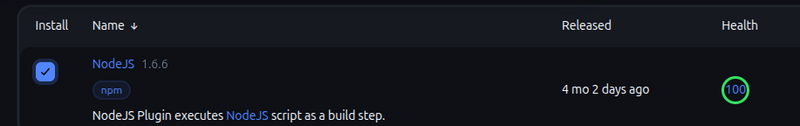

Once installed, configure it under Manage Jenkins → Tools.

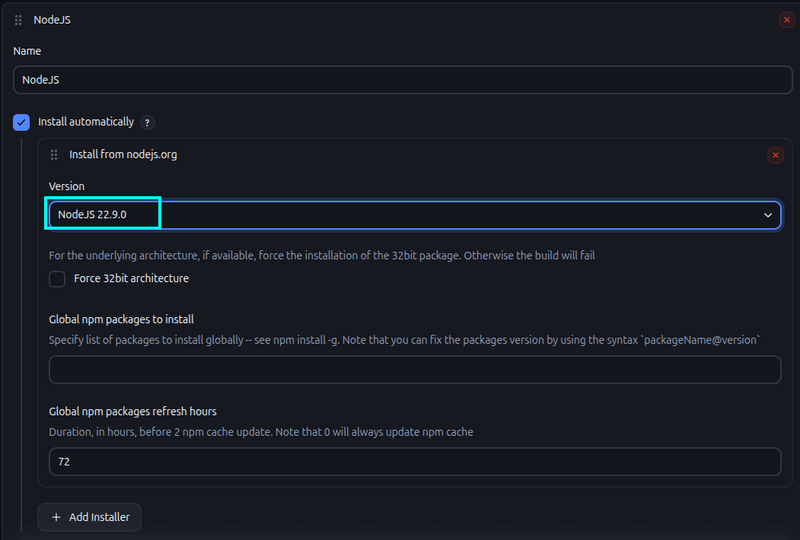

Then add the dependency installation step to the pipeline script.

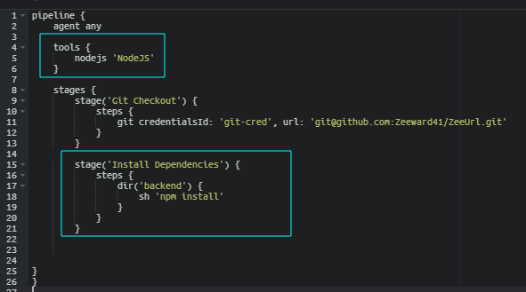

### Unit Tests

Configure the unit tests step.

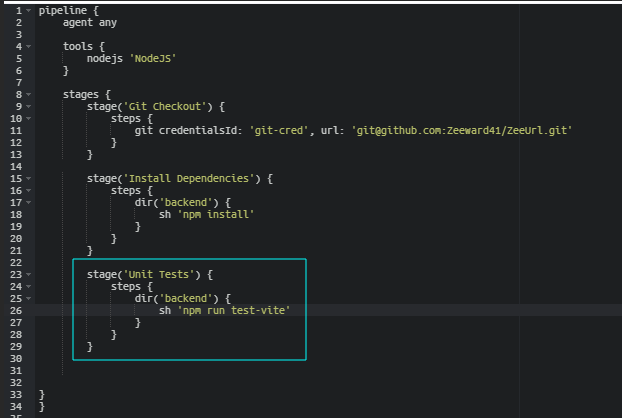

### Trivy

Next, we scan files using Trivy.
First, install Trivy on the Jenkins server:`https://trivy.dev/docs/latest/getting-started/installation/`

```bash
sudo apt-get install wget gnupg
wget -qO - https://aquasecurity.github.io/trivy-repo/deb/public.key | gpg --dearmor | sudo tee /usr/share/keyrings/trivy.gpg > /dev/null
echo "deb [signed-by=/usr/share/keyrings/trivy.gpg] https://aquasecurity.github.io/trivy-repo/deb generic main" | sudo tee -a /etc/apt/sources.list.d/trivy.list
sudo apt-get update
sudo apt-get install trivy
```

Verify installation: trivy --version

Then configure the scan in the pipeline script.

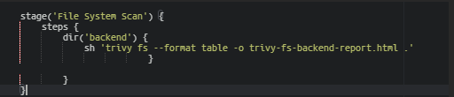

Run the pipeline.

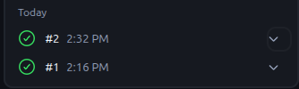

Pipeline reports are located in: `/var/lib/jenkins/workspace/<pipeline_name>/`
Look for the file trivy-fs-backend-report.html (or similar).

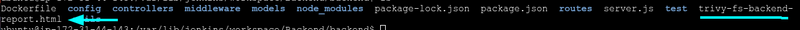

### SonarQube

You need to create an `access token` and install the SonarQube plugin in Jenkins.
The plugin performs the analysis and sends the report to the SonarQube server.

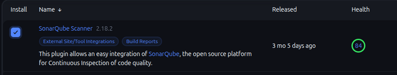

Configure it under Manage Jenkins → Tools.

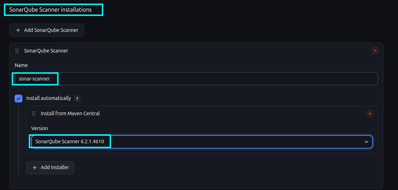

#### On the SonarQube server

(IP of the server with port `9000` – login admin / admin)

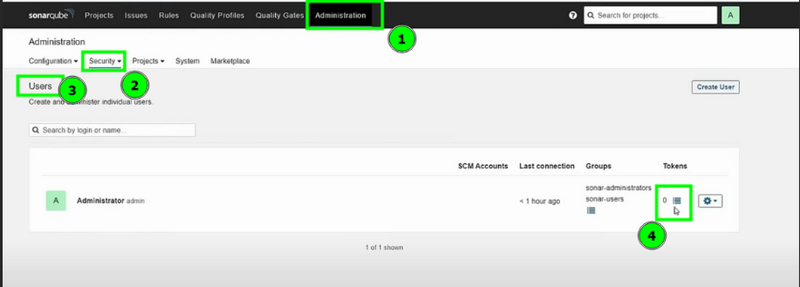
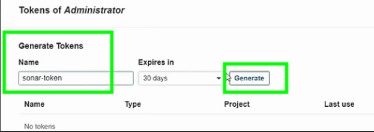
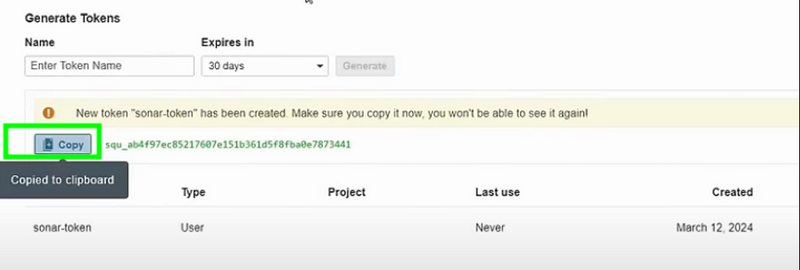

#### On the Jenkins server

Create a new `credential`:
Credentials → System → Global → Add credentials

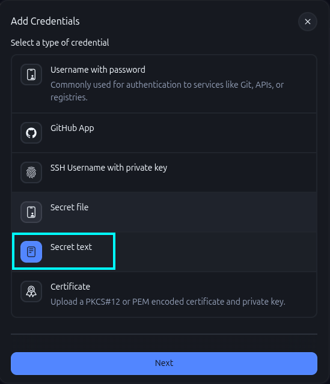
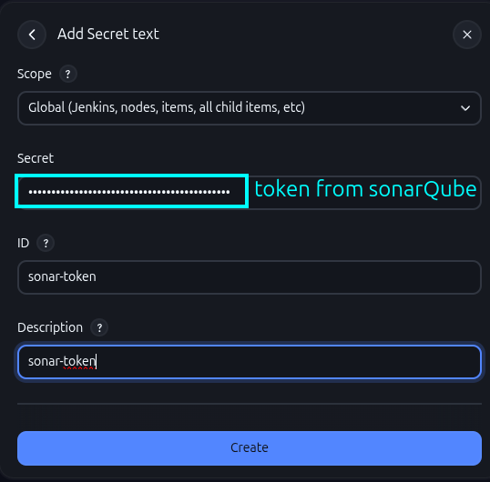

Then tell `Jenkins` to use this credential to connect to the SonarQube server, and provide the server IP.
Under `System`:

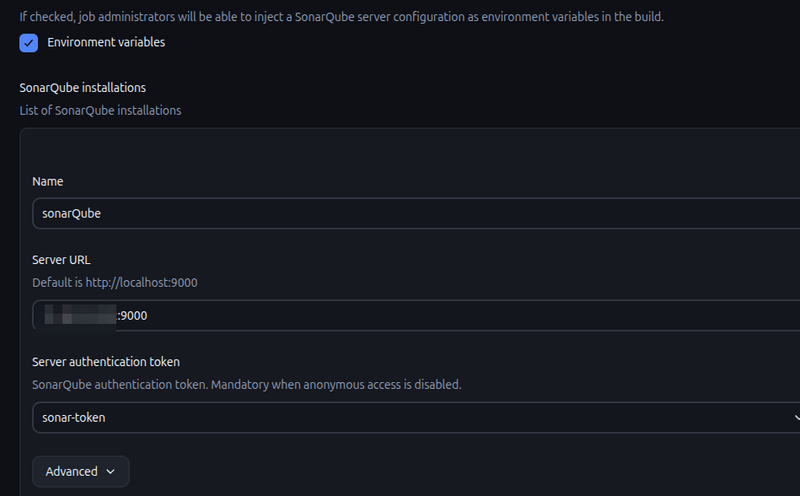

##### important: use `http://sonarQube_ip:9000`

Now add the SonarQube scan step to the pipeline.

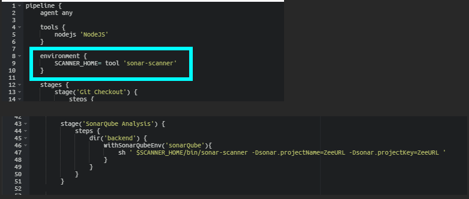

Do not run the pipeline yet — we still need to configure Code Quality first.

## Code Quality

#### On the SonarQube server

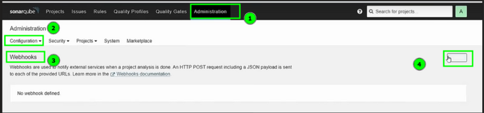
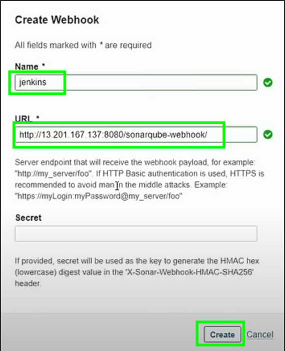

#### On the Jenkins server

Add the corresponding step to the pipeline script.

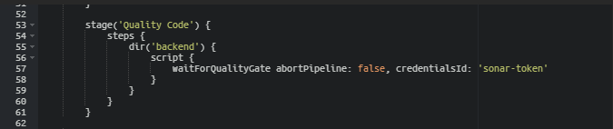

Test the pipeline.

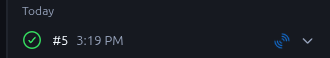

On the SonarQube server, go to Projects.

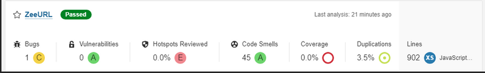

## OWASP Dependency Check

(Documentation: `https://www.jenkins.io/doc/pipeline/steps/dependency-check-jenkins-plugin/`)
Start by installing and configuring the plugin.

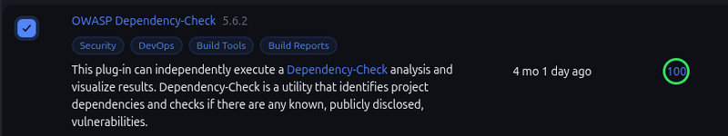

Under Tools.

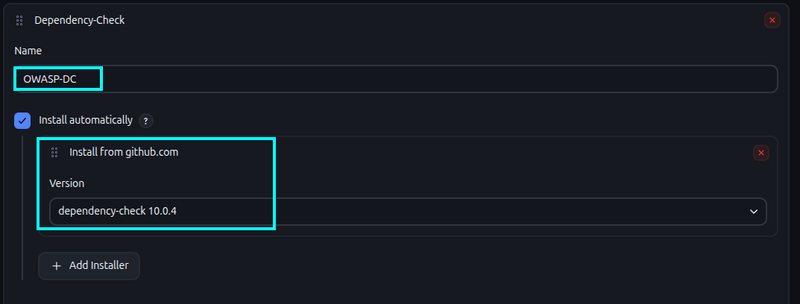

#### RECOMMENDATION

It is strongly recommended to use an `NVD API Key`, otherwise the download is extremely slow.
Go to: `https://nvd.nist.gov/developers/request-an-api-key`
Obtain a key, then create a credential in Jenkins.

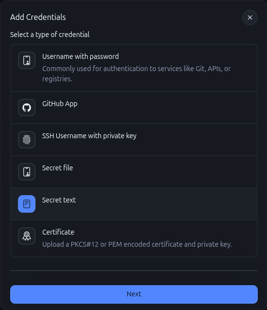
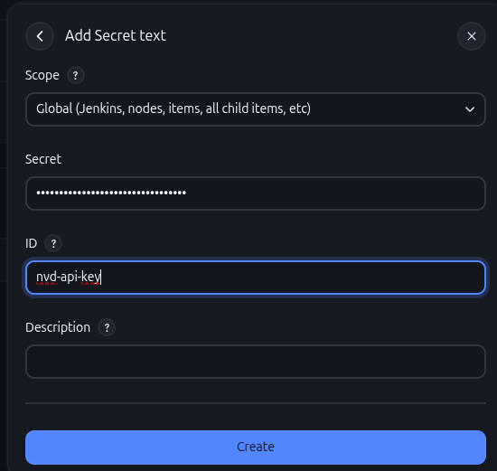

Add the OWASP Dependency-Check stage to the pipeline:

```groovy
stage('OWASP Dependency Check') {
    steps {
        withCredentials([string(credentialsId: 'nvd-api-key', variable: 'NVD_API_KEY')]) {
            dir('backend') {
                dependencyCheck(
                    additionalArguments: "--scan ./ --nvdApiKey ${NVD_API_KEY}",
                    odcInstallation: 'OWASP-DC'
                )
                dependencyCheckPublisher pattern: '**/dependency-check-report.xml'
            }
        }
    }
}
```

After the build, you get the report:

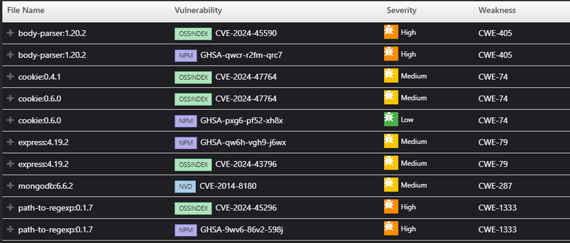

## Docker

Install the Docker and Docker Pipeline plugins.

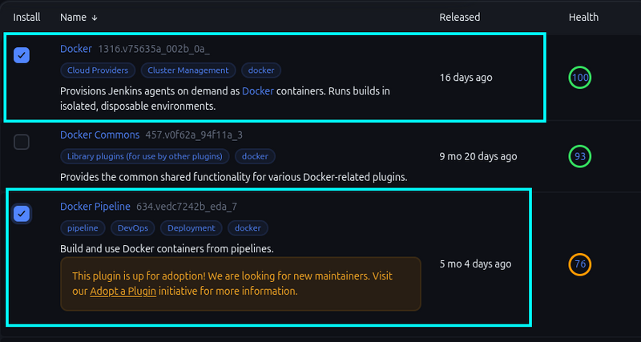

Then configure Docker in Jenkins.

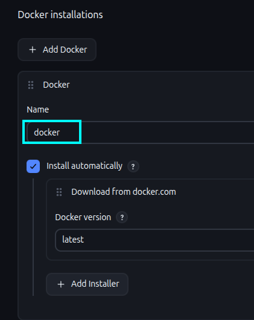

Create a credential for Docker Hub.

##### Important: the username must be lowercase (even if your Docker Hub account has uppercase letters).

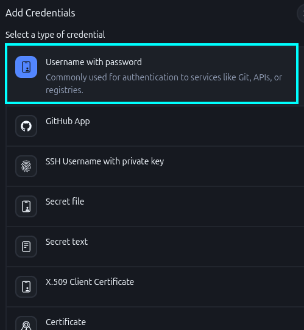
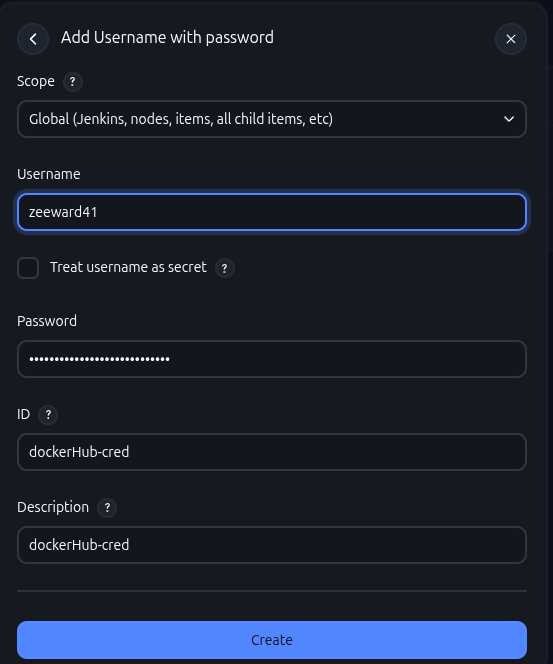

Add the build & tag stage:

```groovy
stage('Build and Tag Docker Image') {
            steps {
                dir('backend') {
                    script {
                        withDockerRegistry(credentialsId: 'dockerHub-cred', toolName: 'docker') {
                            sh "docker build -t zeeward41/test:backend_v1 ."
                        }
                    }
                }
            }
        }
```

## Trivy Image Scan

Scan the newly built image with Trivy.
Reports are located in `/var/lib/jenkins/workspace/<pipeline_name>/`

```groovy
stage('Docker Image Scan') {
            steps {
                dir('backend') {
                    sh 'trivy image --format table -o trivy-image-backend-report.html zeeward41/test:backend_v1'
                }
            }
        }

```

## Docker

Finally, push the image to the Docker Hub repository:

```groovy
stage('Push Docker Image') {
    steps {
            dir('backend') {
                script {
                    withDockerRegistry(credentialsId: 'dockerHub-cred', toolName: 'docker') {
                            sh "docker push zeeward41/test:backend_v1"
                    }
                }
            }
        }
    }
```

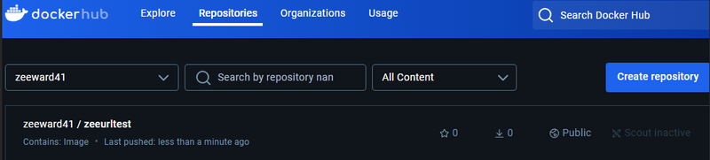

The `backend` pipeline is now complete.
Repeat the same operations for the `frontend` and `range-server`.

Once these steps are done, Jenkins is fully operational and ready to run pipelines.
The server remains online for subsequent builds.
